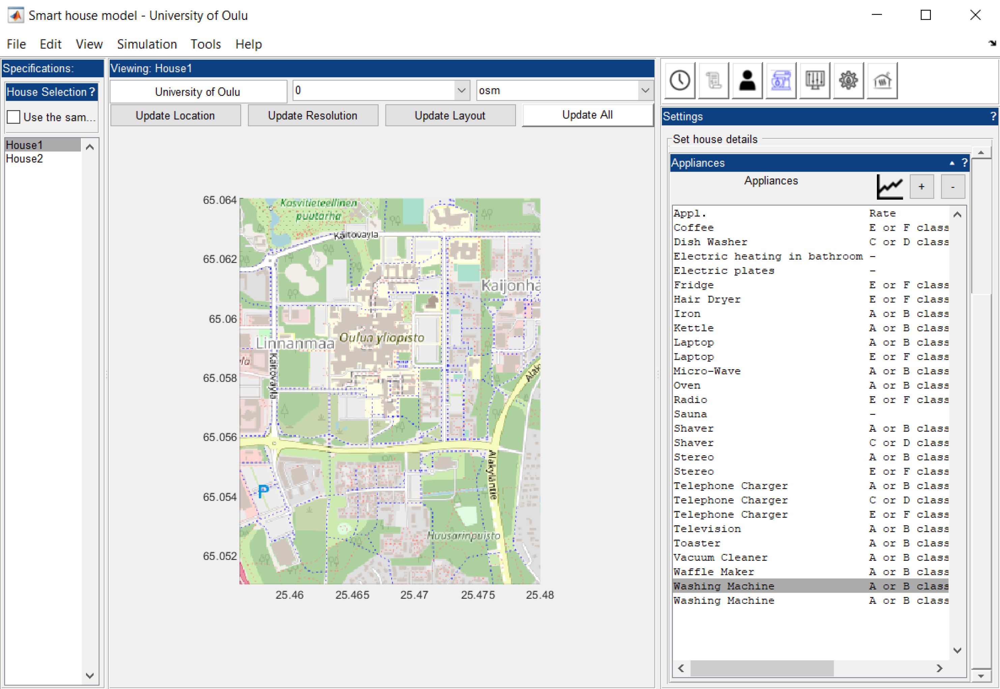

# SBuM
## Smart Building Model

This model was developed to assess the role of smart building in the decarbonisation process of the power system. it was built in MatLab and can be used within MatLab environment. It is possible to set up building simulation from the UI and results can also be retrieved using the same UI. 

It was developed through the Smart Energy Network 2050 financed by the Academy of Finland

_Citation:_

_J.-N. Louis, A. Caló, K. Leiviskä, and E. Pongrácz, ‘Modelling home electricity management for sustainability: The impact of response levels, technological deployment & occupancy’, Energy Build., vol. 119, pp. 218–232, May 2016, doi: http://doi.org/10.1016/j.enbuild.2016.03.012_

### Pre-requisite

Make sure that you have the necessary add-ons to run the model from MatLab. The interface uses the Gui Layout Toolbox that needs to be installed independently from MatLab.

It is available on MatLab File Exchange: [https://se.mathworks.com/matlabcentral/fileexchange/47982-gui-layout-toolbox](https://se.mathworks.com/matlabcentral/fileexchange/47982-gui-layout-toolbox "Gui Layout Toolbox")

### Pre-requisite
Some of the dataset are not available from this repository and requires to be downloaded separately. You can access them from the Zenodo repository at the follwing address: [https://doi.org/10.5281/zenodo.4291941](https://doi.org/10.5281/zenodo.4291941 "Smart Building Model (SBuM) Data")

### How to run the model

Once installed, you can simply send the command '_SBuM_' from the command window and the following interface should pop up.

```matlab
>> SBuM
```





## Publications

1. J.Pulkkinen and J.-N. Louis, ‘Impact of climate change to the total and peak energy demands of a Northern Finnish building by 2050’, in Proceedings of 11th International Conference on Applied Energy, 2019, p. 5, [Online]. Available: http://www.energy-proceedings.org/impact-of-climate-change-to-the-total-and-peak-energy-demands-of-a-northern-finnish-building-by-2050/

2. J.Pulkkinen, J.-N. Louis, and E. Pongrácz, ‘Utilizing Flexibility of Electric Heating in Demand Side Management Programs in Finland in 2050’, in Proceedings of 11th International Conference on Applied Energy, 2019, vol. 4, no. 3, [Online]. Available: http://www.energy-proceedings.org/utilizing-flexibility-of-electric-heating-in-demand-side-management-programs-in-finland-in-2050/.

3. J.-N. Louis and E. Pongrácz, ‘Life cycle impact assessment of home energy management systems (HEMS) using dynamic emissions factors for electricity in Finland’, Environ. Impact Assess. Rev., vol. 67, 2017, doi: http://doi.org/10.1016/j.eiar.2017.08.009.
